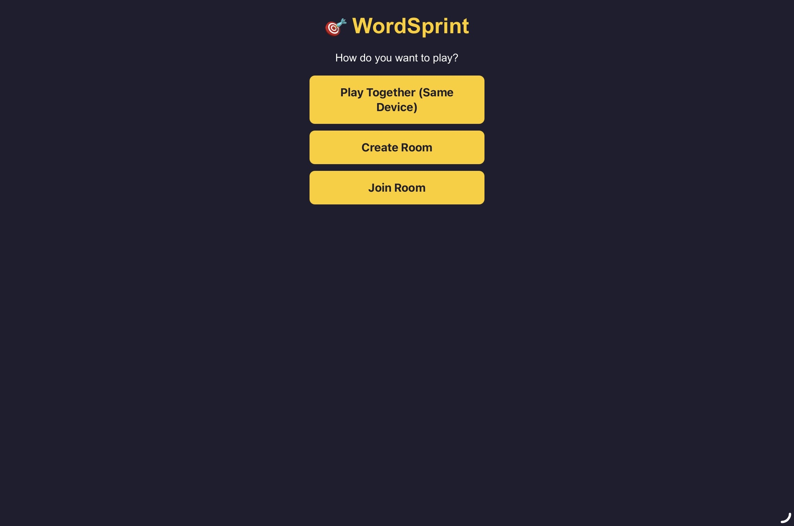
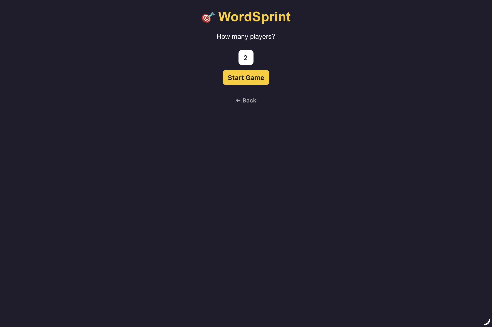
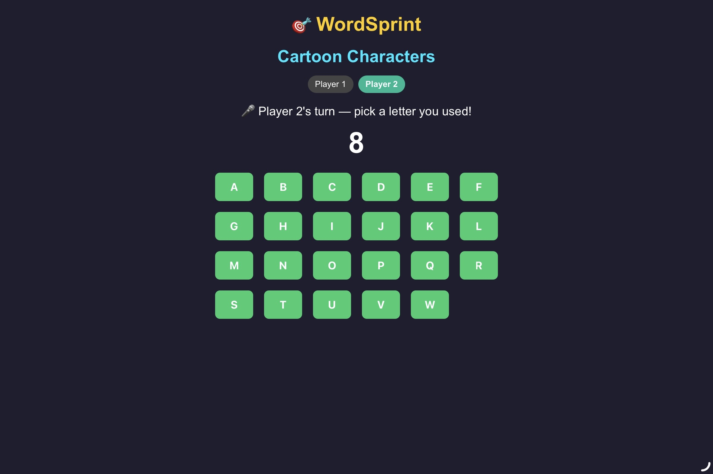

# WordSprint ⚡

WordSprint is a fast-paced browser-based word game inspired by category-and-letter word games. Players race against the clock to think of words that match a given category while using available letters.

The project was developed using Google Apps Script, HTML, CSS, and JavaScript, with Claude AI used as a coding and debugging assistant throughout development.

## How It Works

A category is presented to the player.
The player selects an available letter.
The player enters a word that matches the category and begins with the selected letter.
The selected letter becomes unavailable.
Players continue answering while the timer is running.
The round ends when the required game condition is reached or time runs out.

The game is designed to test quick thinking, vocabulary, decision-making, and reaction speed.

## Features

Category-based word challenges
Interactive letter selection
Used-letter tracking
Countdown timer
Round-based gameplay
Interactive user interface
Browser-based gameplay
Responsive game interactions

## Technologies Used

Google Apps Script — web application platform and application logic
HTML — structure of the game interface
CSS — styling and layout
JavaScript — game logic and interactive functionality
Claude AI — coding assistance, debugging, and development support

## Development Process

WordSprint was developed through multiple iterations.

The initial versions were used to experiment with the core gameplay, user interface, and game logic. Through testing and debugging, different issues were identified and improvements were made before developing the final version.

The development process involved:

Planning the core gameplay
Building an initial prototype
Implementing game mechanics
Testing and debugging
Improving the user interface
Refining game interactions
Developing and testing multiple versions
Consolidating improvements into the final version

## AI-Assisted Development

Claude AI was used as a development assistant during the project.

It was used to assist with:

Code generation and modification
Debugging
Understanding programming concepts
Troubleshooting implementation issues
Exploring possible solutions
Improving parts of the user interface

AI-generated code was reviewed, tested, modified, and integrated into the project as part of the development process.

This project also provided practical experience in using AI tools as part of a modern software development workflow.

## Challenges & Problem Solving

One of the main challenges was converting a physical-style category-and-letter word game into an interactive digital experience.

This required translating game mechanics into software components such as:

Game states
Timers
Letter availability
Player input
User interactions
Round progression

Developing multiple versions allowed different approaches to be tested and improved based on the problems discovered during development.

## What I Learned

Through developing WordSprint, I gained experience in:

Web development using HTML, CSS, JavaScript, and Google Apps Script
Game logic and managing interactive game states
Debugging and troubleshooting implementation issues
User interface design for interactive applications
Iterative development through multiple versions
Problem solving by breaking complex functionality into smaller components
AI-assisted programming using AI as a development and learning tool

## Future Improvements

Possible future improvements include:

Multiplayer functionality
Online matchmaking
Player statistics
Leaderboards
Additional game modes
Improved word validation
More advanced scoring
Persistent player data
Improved mobile experience

## Screenshots

## 📸 Screenshots

### Main Interface

## second page

### Gameplay

## Disclaimer

WordSprint is an independently developed project inspired by the general concept of category-and-letter word games.

It is not affiliated with, endorsed by, or officially connected to Tapple or its creators.

⸻

WordSprint — Think Fast. Find a Word. Sprint to Victory. ⚡
